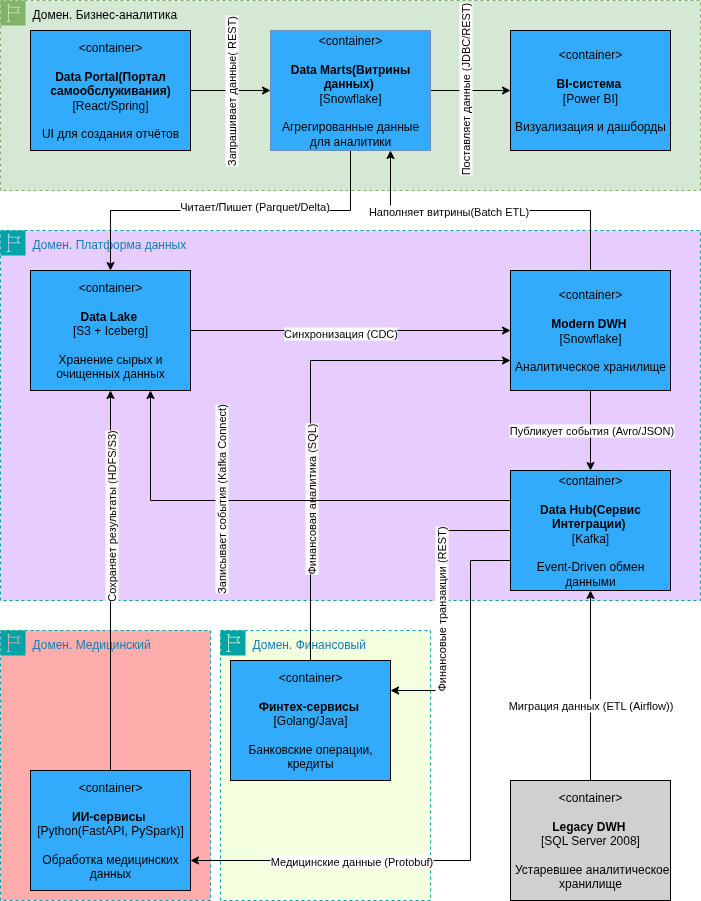

## 1. Container diagram C4
Диаграмма контейнеров: 
Также исходный код для https://app.diagrams.net/ в файле: container_diagram.drawio

## 2. Анализ проблемных мест

|**Проблема**|**Описание**|**Влияние**|
| :-: | :- | :- |
|Устаревший DWH (SQL Server 2008)|Медленные запросы, сложность масштабирования, высокие затраты на поддержку|Задержки отчётов, низкая производительность|
|Разрозненные BI-решения|Множество кастомизаций Power BI, нет единого стандарта|Сложность поддержки, дублирование логики|
|Слабая интеграция между доменами|Шина Apache Camel не справляется с нагрузкой|Задержки в передаче данных, ошибки синхронизации|
|Отсутствие Data Governance|Нет чётких правил работы с данными, метаданными|Риски безопасности, несогласованность данных|
|Медицинские данные в аналитике|Истории болезней попадают в DWH, хотя не нужны для отчётов|Перегрузка хранилища, compliance-риски|

## 3. Приоритизация (MoSCoW)

|**Приоритет**|**Проблема**|**Решение**|
| :-: | :- | :- |
|Must|Устаревший DWH|Миграция на облачное решение (BigQuery/Snowflake)|
|Must|Разрозненные BI-системы|Стандартизация на Power BI + запрет кастомизаций|
|Should|Слабая интеграция|Замена Apache Camel на Kafka + API Gateway|
|Could|Отсутствие Data Governance|Внедрение метаданных (Data Catalog), назначение data-стейкхолдеров|
|Won’t|Медицинские данные в DWH|Вынести в отдельный storage (не трогать в рамках этого проекта)|
