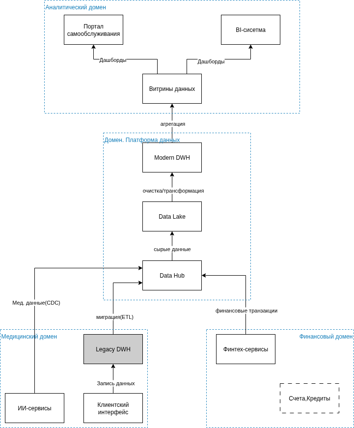

## 1. Разделение на домены

|**Домен**|**Компоненты**|**Ответственность**|
| :-: | :- | :- |
|Медицинский|ИИ-сервисы, DWH (мед. данные), клиентский интерфейс|Обработка медицинских данных, диагнозы, снимки|
|Финансовый|Финтех-сервисы, счета, кредиты, финансовая отчётность|Банковские операции, платежи, кредиты|
|Аналитический|Витрины данных, BI, портал самообслуживания|Агрегация метрик, отчёты, прогнозирование|
|Платформа данных|Data Lake, Modern DWH, сервис интеграции (Kafka)|Хранение, синхронизация и безопасная передача данных между доменами|

## 2. Data Flow Diagram
Диаграмма потоков: 
Также исходный код для https://app.diagrams.net/ в файле: data_flow_diagram.drawio

## 3. Аргументация разделения на домены

### Логика разделения:
1. Принцип bounded context (DDD): 1) Каждый домен отвечает только за свою зону 2) Изменения в одном домене не требуют правок в других
2. Изоляция данных: 1) Медицинские данные физически отделены от финансовых (compliance, GDPR) 2) Аналитика не зависит от сырых данных ИИ
3. Гибкость технологий: Можно использовать разные СУБД (например, Postgres для финтеха, MongoDB для ИИ)

### Влияние на компанию:
|**Преимущество**|**Эффект**|
| :-: | :- |
|Ускорение разработки|Независимые команды могут работать параллельно|
|Масштабируемость|Новый бизнес (например, аптеки) добавляется без переделки DWH|
|Производительность|Витрины загружаются за секунды (не часы)|
|Безопасность|Данные клиентов банка и пациентов клиник изолированы|
|Упрощение поддержки|Нет монолитной бизнес-логики в DWH|
