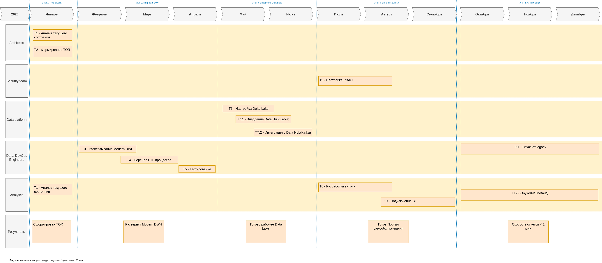

## 1. Технический радар

|**Категория**|**Adopt (Внедряем)**|**Trial (Пилоты)**|**Assess (Изучаем)**|**Hold (Уходим)**|
| :-: | :- | :- | :- | :- |
|Данные|Snowflake, Delta Lake||dbt, Apache Iceberg|Apache Flink|SQL Server 2008|
|Интеграция|Apache Kafka|Debezium (CDC)|–|Apache Camel|
|BI & Аналитика|Power BI|Superset|–|Кастомизированные ETL|
|Инфраструктура|Kubernetes (для ИИ)|Terraform|DataHub|Локальные серверы|
|Методологии|Data Mesh|Data Contracts|–|Монолитный ETL|

## 2. Роадмап на 12 месяцев

Роадмап на 12 месяцев: 
Также исходный код для https://app.diagrams.net/ в файле: roadmap.drawio

## 3. Обоснование этапов

### Этап 1: Подготовка (1 месяц)
Зачем: Выявить все узкие места (например, нагрузку на SQL Server 2008, ручные ETL), чёткие требования к Snowflake, Kafka и витринам
Результат: Отчёт с метриками (время обработки данных, стоимость владения), документ с критериями приёмки для этапа 2

### Этап 2: Миграция DWH (3 месяца)
Зачем: Замена устаревшего SQL Server 2008 на Snowflake для:
    * Ускорения запросов в 10-100 раз
    * Поддержки semi-structured данных (JSON, XML)
    * Автомасштабирования
Результат: Перенос 80% данных, сокращение времени генерации отчётов с часов до минут

### Этап 3: Внедрение Data Hub(Kafka) (2 месяца)
Зачем: Замена Apache Camel на Kafka для:
    * Реального времени обработки данных (CDC)
    * Надёжной доставки событий между доменами
Результат: Финансовые и медицинские данные синхронизируются за секунды

### Этап 4: Витрины данных (3 месяца)
Зачем: Внедрение dbt для:
    * Декларативного описания трансформаций
    * Версионирования SQL-логики
Результат: Витрины обновляются автоматически, time-to-market новых отчётов сокращается с недель до дней

### Этап 5: Оптимизация (3 месяца)
Зачем: Полное выключение SQL Server 2008 и Power Builder для сокращения затрат, переход на новые технологии (Kafka, dbt) требует переквалификации
Результат: Уменьшение эксплуатационных расходов на 40%, 100% команды прошли сертификацию по Snowflake и Airflow